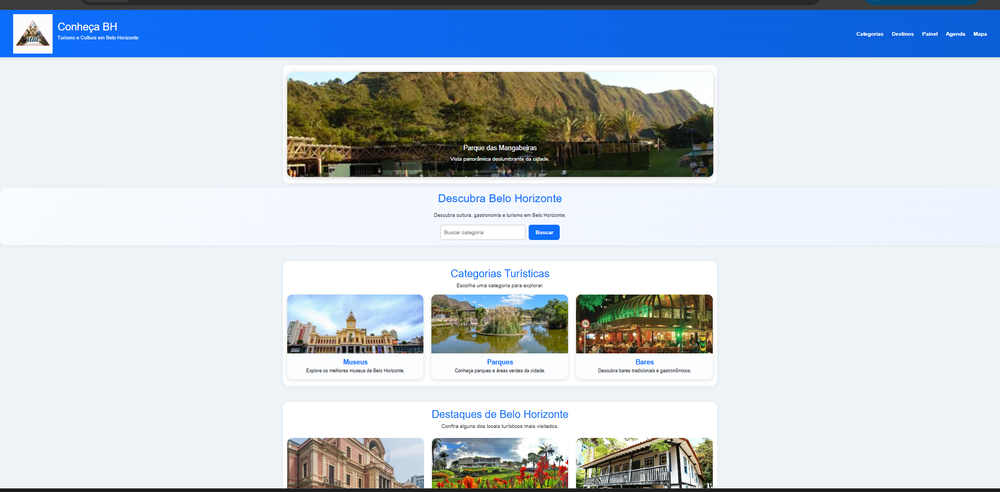
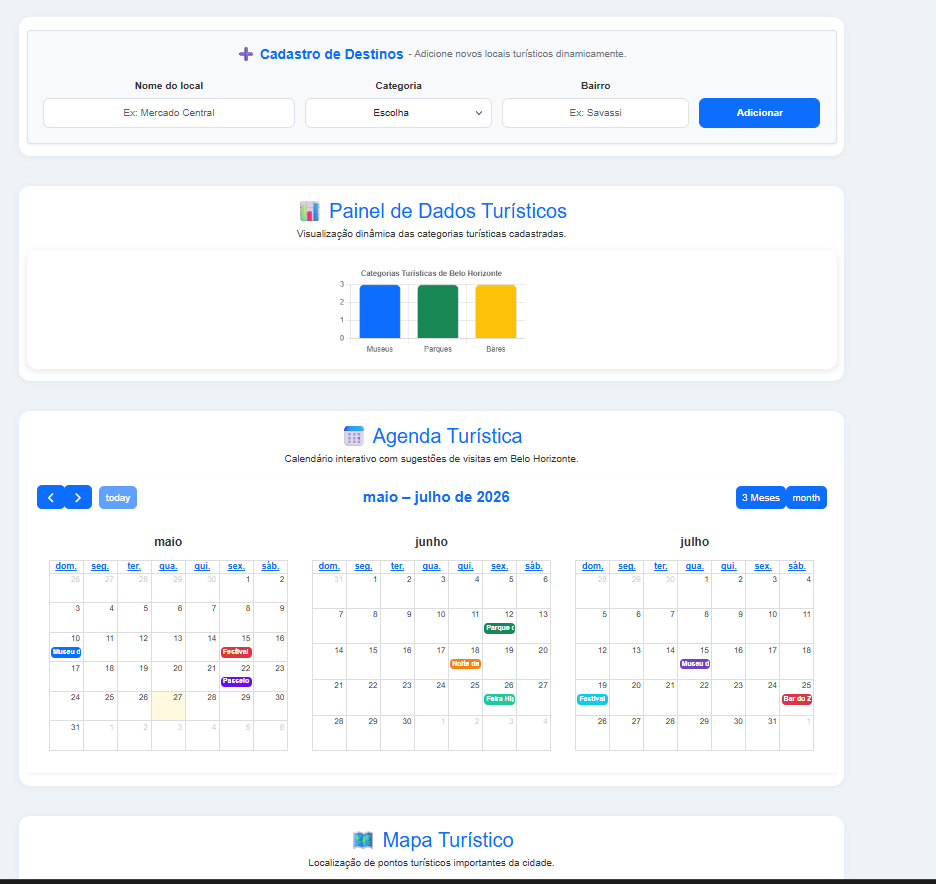
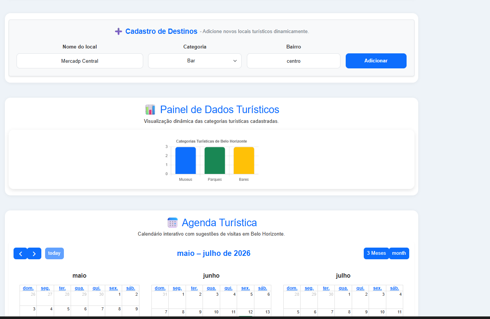
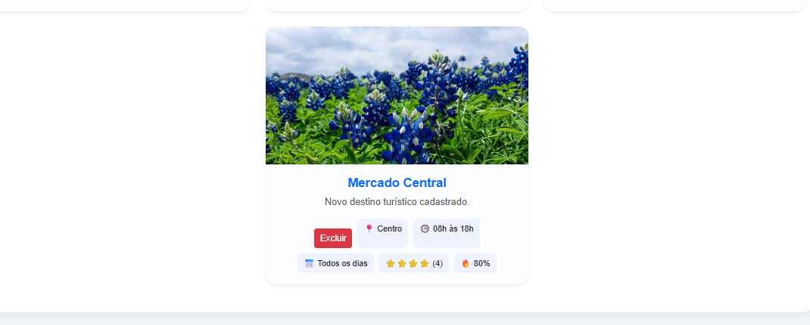

 Semana 14 - Conheça BH

Este projeto foi desenvolvido como atividade prática da Semana 14 da disciplina, com foco na apresentação visual, dinâmica e interativa de dados turísticos de Belo Horizonte.

A aplicação permite explorar destinos turísticos por meio de gráficos, calendário interativo, mapa e funcionalidades de cadastro dinâmico.

Informações do aluno

Nome: Patricia de Souza  
Matrícula: 901262

O projeto tem como objetivo praticar:

Manipulação de dados com JavaScript
Uso de bibliotecas externas
Visualização dinâmica de informações
Estruturação de interfaces web
Interação com o usuário
Implementação de CRUD com LocalStorage

Funcionalidades

Cadastro dinâmico de destinos turísticos
Exclusão de destinos cadastrados
Busca e filtro por categoria
Gráfico de categorias turísticas utilizando Chart.js
Calendário interativo com FullCalendar
Mapa interativo com Leaflet e OpenStreetMap
Persistência de dados com LocalStorage
Atualização dinâmica da interface

Tecnologias utilizadas

HTML5
CSS3
JavaScript
Bootstrap
Chart.js (gráficos de categorias turísticas)
FullCalendar (agenda interativa)
Leaflet + OpenStreetMap (mapa interativo)
LocalStorage

Prints do projeto

Página inicial

Cadastro de destino

Exclusão de destino

